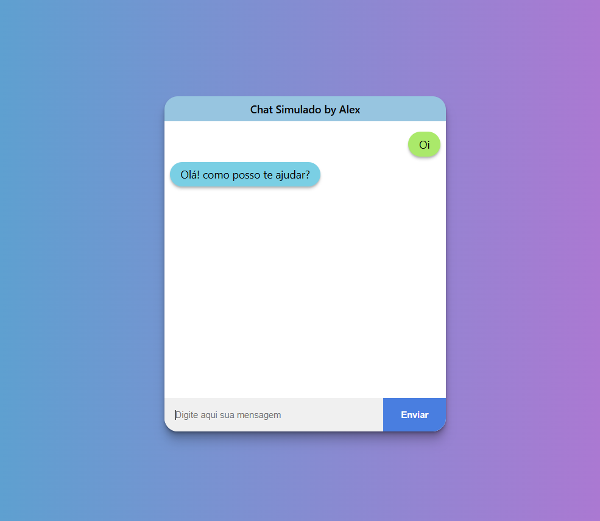

# 💬 Chat Simulado

Um projeto simples, mas bem estruturado, de um chat simulado feito com **HTML**, **CSS** e **JavaScript**, com foco em organização de código, lógica condicional e design agradável.

## 🎯 Objetivo

- Praticar manipulação do DOM
- Aprender a estruturar interfaces com responsividade e estilos modernos
- Desenvolver lógica básica de respostas automáticas

## 🧠 Funcionalidades

- Interface com design moderno (cantinhos arredondados, plano de fundo gradiente)
- Campo de entrada e botão de envio
- Respostas automáticas com base na mensagem do usuário
- Scroll automático ao final das mensagens

## 🚀 Tecnologias usadas

- HTML5
- CSS3
- JavaScript Vanilla

## 🖼️ Screenshot

## 🌍 Acesse o projeto online

➡️ [Clique aqui para ver o Chat Simulado funcionando!](https://alexanderduarte.github.io/chat-simulado/)

## 📁 Estrutura de arquivos
chat-simulado/
- index.html
- style.css
- main.j
- README.md

## 🧪 Próximos passos

- Implementar respostas mais avançadas
- Melhorar acessibilidade
- Criar versão com localStorage
- Versão futura em React

---

> Feito com dedicação por [Alexander Duarte](https://github.com/AlexanderDuarte) 
